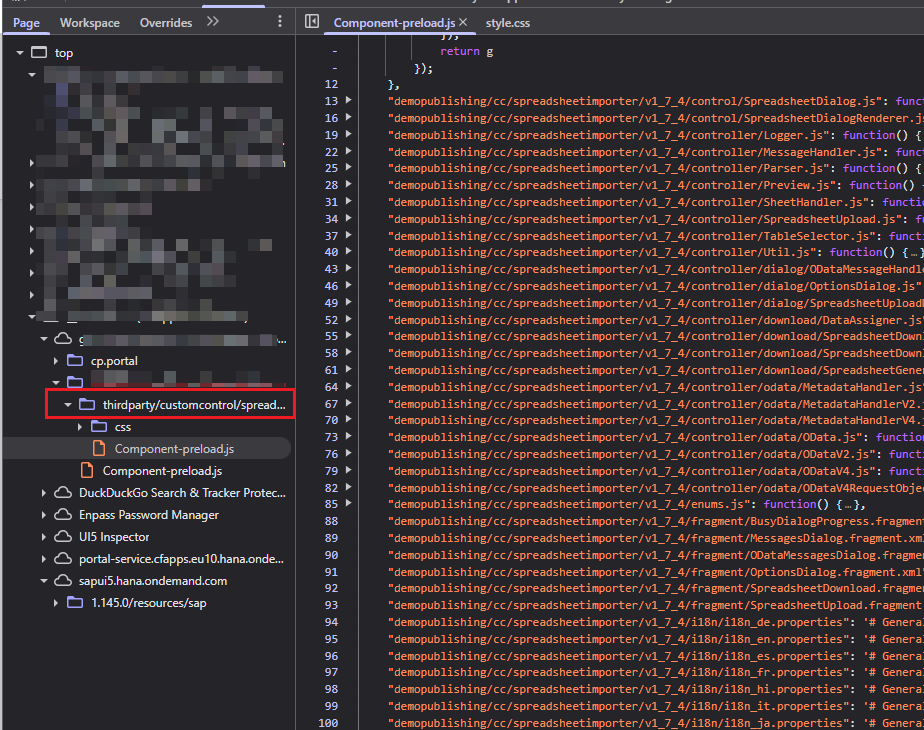
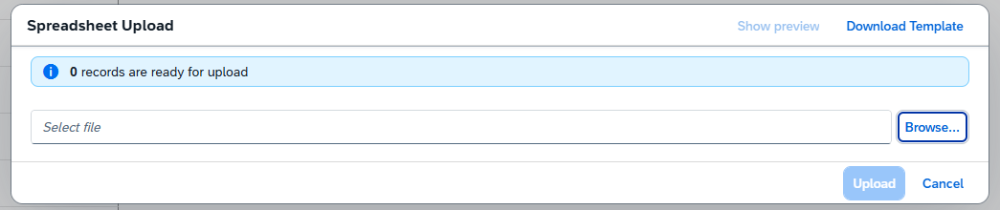

# Embedded Spreadsheet Importer Component Deployment

Small sample CAP project with 2 FE application which both use the [Spreadsheet Importer](https://docs.spreadsheet-importer.com/pages/GettingStarted/#btp-environment) with decentralized (embedded) deployment.

To avoid the mentioned issues, a custom script is used post ui5 build, to make the component id of the embedded spreadsheet importer unique to the consuming application

## Rename of Spreadsheet Importer Component

The renaming script [/scripts/fix-spreadsheet-comp-id.js](./scripts/fix-spreadsheet-comp-id.js) is using conventions to take the zip name and app id from the `ui5-deploy.yaml`. At the end the
component name is renamed from `cc.spreadsheetimporter.v1_7_4` to e.g. `demobookshop.cc.spreadsheetimporter.v1_7_4`.

Doing this gets rid of duplicate id issues during refreshing the content channel in SAP Build Workzone.

### Impressions

#### Loaded Spreadsheet Importer Component embedded in Application

> NOTE: only Component-preload.js is loaded, which shows correct replacements of the official component id

#### Upload Dialog with all translated texts

